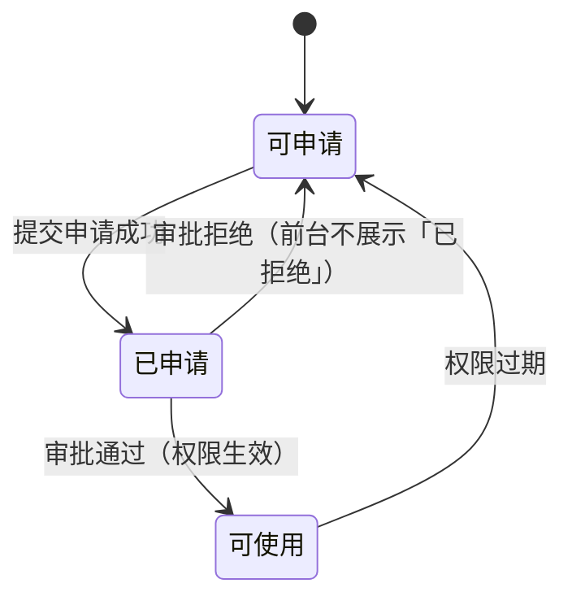
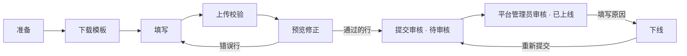
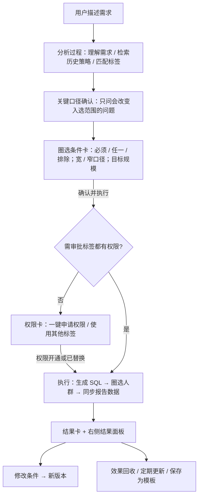
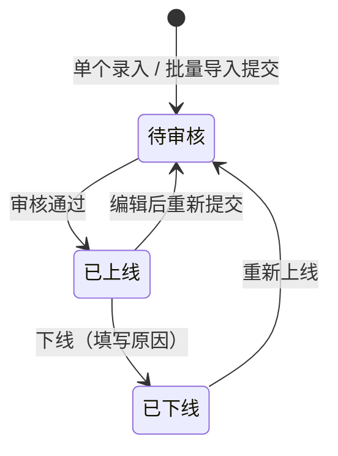

# 统一交易画像门户 V2 PRD

| 项 | 内容 |
|---|---|
| 文档版本 | V2.0 草案 · 2026-10-08 |
| 文档类型 | 正式 PRD（平台型需求 + AI 能力接入） |
| 范围 | 多选与待选择清单、消费方体验更新、供给方资产接入、圈人 Agent 接入 |
| 演示环境 | https://utup-mvp-frontend.vercel.app（演示数据，不连接真实审批与数据服务） |
| 关联文档 | 《门户V2功能说明》（字段与规则明细）、9/29「对一下门户和圈人 demo」会议纪要 |
| 状态标记 | ✅ Demo 已实现 ｜ 🛠 待开发 ｜ ❓ 待确认 |

---

## 1. 决策摘要

**一句话结论**：V2 把门户从「能找到、能单个申请」升级为「能批量挑选与申请、资产能规范批量接入、圈人需求能直接产出人群包」，服务 Q4 两个目标：**提升资产挂载渗透率**、**圈人 Agent 上线 MVP 并支撑收益验证**。

**本次需要拍板的事项**

| # | 决策 | 建议 | 影响 |
|---|---|---|---|
| D1 | 是否按本 PRD 范围立项 V2 | 同意，P0 先行 | 排期 |
| D2 | Triton 审批状态的获取方式 | 推动 Triton 开放按单号查询（门户接口账号加入审批人）或推送 | **上线阻塞**：决定「审批中 / 被拒绝」能否区分 |
| D3 | AI 智能搜索选方案 A（独立入口）还是 B（搜索框切换） | 先 A，灰度后看数据 | 消费方入口形态 |
| D4 | 资产审核人 | 平台管理员终审，来源域负责人可选初审 | 资产接入流程 |
| D5 | 待选择清单、圈人任务、资产数据改为服务端存储 | 同意 | 研发工作量 |

---

## 2. 背景与真实问题

### 2.1 现状

门户 MVP 已具备标签广场检索、单个标签申请、我的申请 / 权限、消费与收益录入、供给方工作台。9/29 会议与评审暴露以下问题：

| # | 角色 | 现状做法 | 痛点 | 机制原因 |
|---|---|---|---|---|
| P1 | 消费方 | 一个标签一个标签地申请 | 同一业务需求通常要 3–10 个标签，逐个填表成本高、容易漏 | 缺少「先挑后提」的集合容器与批量提交 |
| P2 | 消费方 | 边看边想，看完一个申请一个 | 无法对比多个标签再决定，「像淘宝购物」的决策过程不被支持 | 缺少可回看、可增删的待申请集合 |
| P3 | 消费方 | 到期才发现权限失效 | 实验与投放中断 | 到期信息只在详情里，没有集中提醒 |
| P4 | 消费方 | 不知道该用哪些标签 | 依赖口口相传，找标签成本高 | 只有关键词检索，没有「从业务场景到标签组合」的引导 |
| P5 | 供给方 | 资产靠人工对接、零散登记 | 渗透率提升慢；字段口径、密级登记不一致 | 没有统一的接入模板、校验与审核流程，不支持批量 |
| P6 | 业务 / 策略 | 圈人需求要找数据同学写 SQL | 周期长，口径反复确认，结果难复用 | 缺少把业务语言转成标签条件并直接产出人群包的工具 |

### 2.2 为什么现在做

- Q4 门户考核「资产挂载渗透率」，P5 是直接瓶颈。
- 圈人 Agent 需要在答辩前形成可演示、可产出的 MVP，并与婉颖的品侧能力对齐。
- MVP 已有用户在用，P1–P3 是评审中反馈最集中的问题。

---

## 3. 用户、场景与任务

| 角色 | 典型场景 | 任务 | 阻碍 | 期望结果 |
|---|---|---|---|---|
| 消费方（业务 / 算法 / 运营） | 为一次营销活动准备标签 | 找到并申请一组标签 | 逐个申请、不会选 | 一次挑好、一次提交，进度清楚 |
| 消费方 | 已有权限的日常使用 | 管理权限有效期 | 到期无感知 | 提前看到即将到期与已过期，一键再次申请 |
| 消费方（不熟悉标签） | 只知道业务目标 | 从目标找到标签组合 | 不知道标签名 | 描述场景即可得到推荐组合 |
| 供给方（资产 Owner） | 新资产上线 / 批量迁移 | 把资产登记进门户 | 字段多、口径不统一、无法批量 | 下载模板批量导入，错误逐行可见 |
| 平台管理员 | 资产上架前把关 | 审核口径与密级 | 无统一入口 | 待审核集中处理，上下线可追溯 |
| 业务 / 策略（圈人） | 新品推广、老客召回等 | 把业务需求变成人群包 | 依赖数据同学、口径反复 | 对话式确认口径，直接拿到可复核人群包 |

---

## 4. 目标、成功指标与非目标

### 4.1 目标与指标

| 目标 | 指标 | 口径 | 基线 | 目标值 | 观测周期 |
|---|---|---|---|---|---|
| 申请更高效 | 批量申请占比 | 一次提交 ≥ 2 个标签的申请批次 / 全部申请批次 | 0（MVP 不支持） | ❓ 上线后 4 周确定 | 上线后 4 周 |
| 申请更高效 | 人均完成一组申请的耗时 | 首次加入清单 → 提交成功 | 待埋点采集 | 较单个申请下降 | 上线后 4 周 |
| 减少权限中断 | 过期后 7 天内再次申请率 | 过期标签中 7 天内再次申请的比例 | 待采集 | 提升 | 月度 |
| 资产渗透率（Q4 KPI） | 资产挂载渗透率 | 已上线资产数 / 资产一览表中应接入资产数 | 待供给方盘点 | ❓ 与 Q4 OKR 对齐 | 周度 |
| 接入效率 | 批量导入一次通过率 | 校验通过行数 / 上传行数 | — | 持续提升 | 周度 |
| 圈人可用 | 圈人任务完成率 | 产出人群包的任务 / 创建的任务 | — | ❓ | 上线后 4 周 |
| 圈人有价值 | 有效果回填的任务占比 | 回填 LR / 实验结论的任务 / 已完成任务 | — | ❓ | 月度 |

无法在上线前给出基线的，统一在 P0 中完成埋点，上线 4 周后回填目标值。

### 4.2 非目标（本期不做）

- 不在门户内落审批工单，审批仍在 Triton 完成，门户只做路由与预填。
- 不展示标签**枚举值 / 示例值**，不展示**历史案例的收益数值**。
- 不支持「系统间调用 / 线下对接」类申请，所有标签都走线上申请。
- 有权限的标签不提供「去使用」跳转：各用户的用数平台和方式不同，无法统一跳转与量化。
- 资产接入不包含审批方式、消费约束（允许场景、导出、脱敏、配额）配置。
- 圈人 Agent 本期不做策略知识库共建、不做 HTE 自动复盘（仅预留）。

---

## 5. 需求范围与优先级

| 模块 | 需求 | 优先级 | 状态 |
|---|---|---|---|
| 多选 | 待选择清单（加入 / 按行勾选 / 批量申请 / 批量移除 / 上限 100） | P0 | ✅ |
| 多选 | 标签广场列表视图批量勾选（卡片不支持、跨页保留、只加入清单） | P0 | ✅ |
| 多选 | 申请表单（单个与批量共用，场景自带标准说明） | P0 | ✅ |
| 消费方 | 三态展示（可申请 / 已申请 / 可使用） | P0 | ✅（依赖 D2） |
| 消费方 | 到期警示列出具体标签 | P0 | 🛠 |
| 消费方 | 我的申请：有效期橙 / 红、四个指标卡（含即将到期） | P0 | 部分 ✅ / 🛠 |
| 消费方 | 标签广场每页 20 / 40 / 60、4 列布局 | P1 | 部分 ✅ / 🛠 |
| 消费方 | 来源域卡片多选、双击取消、悬停与选中区分 | P1 | 部分 ✅ / 🛠 |
| 消费方 | 列表视图标签名完整展示 | P1 | 🛠 |
| 消费方 | AI 智能搜索 | P1 | ✅ Demo（关键词匹配） |
| 供给方 | 资产接入：单个录入、CSV 批量导入、逐行校验、审核、上下线、导入记录 | P0 | ✅ Demo |
| 供给方 | 已上线资产同步到标签广场 | P0 | 🛠 |
| 圈人 Agent | 对话式圈人主流程（口径确认 → 条件 → 权限 → 执行 → 结果） | P0 | ✅ Demo |
| 圈人 Agent | 与门户权限、待选择清单联动 | P0 | ✅ Demo |
| 圈人 Agent | 真实 NL2SQL 与人群执行 | P0 | 🛠 |
| 圈人 Agent | 定期更新、效果回收 | P1 | ✅ Demo（文案与录入） |

---

## 6. 产品方案与端到端流程

### 6.1 全局：标签状态

前台只展示三种状态，内部状态统一映射：

| 前台状态 | 内部情况 | 判定 | 能否加入清单 / 申请 | 卡片表现 |
|---|---|---|---|---|
| 可申请 | 从未申请；被拒绝；已过期 | 无有效权限且无审批中申请 | 是 | 无角标 |
| 已申请 | 审批中 | 有申请记录、审批未结束 | 否 | 右下角斜挂蓝色「已申请」 |
| 可使用 | 有有效权限（含门户上线前已有） | 实时权限接口 | 否 | 无角标、无跳转 |

### 6.2 多选与待选择清单（先挑后提）

**入口与触发**

| 入口 | 操作 | 规则 |
|---|---|---|
| 标签详情 | 加入待选择清单 / 直接申请 | 已在清单时按钮为「已加入 · 查看待选择清单」 |
| 标签广场列表视图 | 切到列表 → 勾选 → 「加入待选择清单（n）」；卡片视图不支持 | 见 7.1 |
| AI 智能搜索 | 单个「+ 加入清单」/「核心标签加入待选择清单」 | 只加入可申请标签 |
| 圈人 Agent | 权限卡「一键申请权限」 | 只带入受控 / 高敏且可申请标签，并打开清单页 |

**系统反馈**：加入后停留当前页，提示「已加入 n 个标签 · 去查看清单 →」。

### 6.3 消费方：标签广场与我的申请

- 顶部标签页：标签广场 ｜ ✦ AI 智能搜索 ｜ 待选择清单 n，切换整个内容区。
- 到期警示条：列出即将过期（≤ 7 天）与已过期的具体标签，跳转「我的申请」处理。
- 卡片：4 列；底栏「来源域 · 更新频率」；右下角只出现「已申请」角标；有权限的标签不做跳转。
- 详情：元信息、我的权限、数据使用合规说明；不展示枚举值。

### 6.4 供给方：资产接入

单个录入与批量导入共用同一套字段与校验，字段分三组：基础展示、表单归属、密级与状态（明细见《门户V2功能说明》3.2）。

### 6.5 圈人 Agent

布局：左侧（新建对话 / 圈人任务中心 / 策略知识库〔规划中〕/ 历史对话）+ 中间对话 + 右侧结果面板（人群明细、人群概览、圈选条件、相关 SQL、人群报告、效果回收）。

---

## 7. 详细规则、状态与异常

### 7.1 标签广场批量勾选（仅列表视图）

| 规则 | 说明 |
|---|---|
| 范围 | 当用户处于卡片视图时，系统不提供勾选；当用户切到列表视图时，第一列常驻勾选框 |
| 可勾选 | 当标签为「可申请」且不在清单中时显示勾选框；否则不显示 |
| 本页全选 | 表头勾选框选择本页可申请标签；再次点击取消 |
| 行点击 | 点击行打开详情，不触发勾选 |
| 跨页 | 当用户翻页或修改筛选时，系统保留已勾选并累计；切回卡片视图时清空 |
| 提交 | 广场内只能「加入待选择清单」，不可直接批量申请 |
| 布局 | 卡片每页 20 个（可选 40 / 60 🛠），固定 4 列；窗口 < 1100px 时降为 2 列 |

### 7.2 待选择清单

| 规则 | 说明 |
|---|---|
| 容量 | 最多 100 个；当加入后超过 100 时，超出部分不加入，并提示先提交或移除 |
| 展示 | 按行，每页 10 行；列：☑、标签名称、分级、口径描述、来源于、状态（可申请 / 不可申请·标签已下架）；左下角始终显示「第 x / y 页 · 共 n 个标签」，右下角翻页 |
| 顶部栏 | 已选择 n 个标签 + 批量删除 + 一键批量申请 |
| 勾选 | 表头勾选当前页；跨页保留；不可申请行浅橙并显示原因 |
| 批量申请 | 若已选中包含不可申请标签，则按钮置灰并提示「其中 x 个当前不能申请」 |
| 批量移除 | 已选均可移除，移除后提示数量 |
| 状态变化 | 当清单中标签变为已申请 / 可使用时，行内实时更新状态 |
| 存储 | 服务端按用户存储 🛠（Demo 为浏览器本地） |

### 7.3 申请表单

| 规则 | 说明 |
|---|---|
| 共用 | 单个与批量共用；公共用途默认用于全部标签，可逐项单独设置 |
| 使用场景 | 下拉只显示场景名；场景自带标准使用说明，折叠展示，随申请提交 |
| 补充说明 | 选填；填写后追加在标准说明之后提交 |
| 建单 | 每个标签独立建单；提交成功项从清单移除 |
| 部分失败 | 若部分提交失败，则成功项不重复提交，只重试失败项 |
| 防重 | 若标签为「已申请」，则不可再次提交 |

### 7.4 我的申请 / 权限

| 申请 / 权限状态 | 操作 | 颜色 |
|---|---|---|
| 生效中 | 详情（不做跳转） | 主色 |
| 已过期 | 详情 + 再次申请 | 主色 |
| 未生效 · 被拒绝 | 详情 + 再次申请 | 主色 |
| 未生效 · 审批中 | 详情 + 审批中（置灰） | 灰色 |

| 有效期 | 颜色 |
|---|---|
| > 7 天 / 永久 | 默认 |
| ≤ 7 天 | 橙色 🛠 |
| 已过期 | 红色 🛠 |

指标卡：申请单总数（门户提交次数）、即将到期（已有权限且有效期 ≤ 7 天，替换原「未生效」）、已生效（当前有权限）、已过期（曾有效现失效）；点击可筛选。排序：❓「正序」口径待确认（当前最新在前）。

### 7.5 资产接入

**字段**（明细见功能说明 3.2.1）

| 分组 | 字段 |
|---|---|
| 基础展示 | `tag_id`、`tag_name`、`description`、`coverage`、`timeliness`（1 离线 / 2 实时）、`update_freq` |
| 表单归属 | `owner`、`owner_team`（选填）、`source_system`（所属域）、`source_table`、`source_field` |
| 密级与状态 | `table_security`、`column_security_level`、`effective_column_level`（系统计算）、`status`（online / off） |

**规则**

| 规则 | 说明 |
|---|---|
| 时效联动 | 当 `timeliness = 2` 时，`update_freq` 自动为「实时」且不可改；当 `timeliness = 1` 时，`update_freq` 必须为 T+1 或 T+7 |
| 生效密级 | `effective_column_level = max(table_security, column_security_level)`；列密级为空时等于表密级；上传值忽略 |
| 识别 | 以 `tag_id` 识别：不存在为新增，已存在为更新（展示差异） |
| 校验 | 必填、格式、枚举、时效联动、Owner / 来源表 / 来源字段存在性、文件内 ID 重复 |
| 部分成功 | 校验通过的行可先提交，错误行留待修正，可下载错误清单 |
| 上限 | 单文件 ≤ 500 行 ❓ |
| 审核 | 新增与更新均进入「待审核」；审核通过后 `online` 并同步到标签广场 🛠 |
| 下线 | 必须填写原因（≥ 4 字）；下线后标签广场不再展示；已有权限是否保留 ❓ |

**资产状态**

### 7.6 圈人 Agent

| 环节 | 规则 |
|---|---|
| 口径确认 | 只追问会改变入选范围的口径；原话已明确的不重复确认 |
| 条件 | 必须满足 AND、任一满足 OR、排除 NOT；可删除条件；宽 / 窄口径二选一并给预估规模；目标规模超出时按偏好分截取 |
| 权限 | 判定口径与门户一致；仅受控 / 高敏需审批，开放 / 通用视为自助开通 |
| 一键申请 | 带入待选择清单并打开清单页；提交后可返回原对话继续 |
| 使用其他标签 | 替换为当前可直接使用的标签；无替代时去掉该条件；生成新版本 |
| 版本 | 每次执行结果绑定条件版本；条件修改后、未重新执行前，结果面板提示当前展示版本 |
| 定期更新 | 开启后每天 08:00 按当前版本条件重算，人群包 ID 不变；条件修改或权限失效时暂停并提醒 🛠 |
| 展示约束 | 不展示历史案例收益数值；人群明细只展示脱敏样例 |

### 7.7 异常与空态

| 场景 | 系统行为 |
|---|---|
| 清单为空 | 展示空态与「去挑标签」 |
| 清单超过 100 | 超出部分不加入并提示 |
| 申请提交部分失败 | 成功项记录，失败项可单独重试 |
| 权限接口超时 | 状态显示「状态查询中」，不允许提交申请，提示稍后重试 🛠 |
| Triton 状态不可得 | 审批中与被拒绝无法区分，统一按「已申请」处理，允许用户在 Triton 核实后再次申请 ❓（取决于 D2） |
| 导入文件缺列 | 拒绝解析并列出缺失列 |
| 导入超过上限 | 只校验前 500 行并提示 |
| Agent 执行失败 | 保留条件与版本，提示原因，可重试；连续失败转人工 🛠 |
| 存储不可用 | 提示「清单暂无法保存」，当前页仍可操作 |

---

## 8. 权限、数据、埋点与监控

### 8.1 角色权限

| 能力 | 消费方 | 供给方 | 平台管理员 |
|---|---|---|---|
| 标签广场 / 待选择清单 / 申请 | ✅ | — | ✅ |
| 我的申请 / 权限 | ✅ | — | ✅ |
| 圈人 Agent | ✅ | — | ✅ |
| 资产接入：录入 / 导入 / 下线 | — | ✅（本域） | ✅ |
| 资产审核上线 | — | — | ✅ |
| 审计日志 | ✅（本人） | ✅（本域） | ✅（全部） |

### 8.2 数据与接口依赖

| 依赖 | 用途 | 负责方 | 状态 |
|---|---|---|---|
| 用户 × 标签实时权限接口 | 可使用、有效期、过期 | 数据平台 | 可用，需确认延迟 |
| Triton 审批状态 | 审批中 / 被拒绝 | Triton | ❗ 阻塞（D2） |
| Triton 申请深链 | 预填并发起申请 | Triton | 可用 |
| 飞书通讯录 | 校验 Owner 账号 | 飞书开放平台 | 🛠 |
| 元数据服务 | 校验来源表 / 字段 | 数据平台 | 🛠 |
| 门户服务端存储 | 清单、资产、导入记录、圈人任务 | 门户研发 | 🛠 |
| NL2SQL 与人群执行 | 圈人 Agent 产出真实人群包 | 圈人 Agent 研发 | 🛠 |

### 8.3 审计留痕

查看标签详情、加入 / 移除清单、提交申请、资产新增 / 更新 / 审核 / 下线、批量导入、圈人执行均写入审计日志；**页面与日志均不展示申请单号**。

### 8.4 埋点

| 事件 | 关键属性 | 用于指标 |
|---|---|---|
| 加入清单 | 入口（详情 / 批量 / AI / Agent）、数量 | 批量占比、入口贡献 |
| 提交申请 | 标签数、是否来自清单、耗时 | 批量申请占比、申请耗时 |
| 再次申请 | 原状态（过期 / 被拒） | 过期再申请率 |
| AI 推荐采纳 | 推荐数、加入数 | AI 搜索价值 |
| 资产导入 | 行数、通过 / 失败数、失败原因分布 | 一次通过率 |
| 资产上线 / 下线 | 来源域、密级 | 渗透率 |
| 圈人任务 | 阶段到达、完成、权限阻断、回填 | 完成率、回填率 |

### 8.5 监控

权限接口成功率与耗时、申请深链跳转成功率、导入解析失败率、Agent 执行失败率，异常超阈值告警到门户值班群 🛠。

---

## 9. 验收标准

### 9.1 功能正确（核心用例）

| # | 用例 | 预期 |
|---|---|---|
| A1 | 切到列表视图勾选 2 个、翻页再勾 1 个 | 底部栏「已选 3 个」，加入后清单 +3，提示含「去查看清单」；卡片视图无勾选框 |
| A2 | 列表视图中「已申请」「可使用」「已在清单」的行 | 不显示勾选框 |
| A3 | 清单中勾选含 1 个已申请标签 | 「批量申请」置灰，提示其中 1 个不能申请；「批量移除」可用 |
| A4 | 清单已有 99 个，再加入 3 个 | 只加入 1 个，提示超出上限 |
| A5 | 申请表单只选场景不填补充说明提交 | 提交成功，记录中包含场景与标准使用说明 |
| A6 | 提交 3 个标签，模拟最后一个失败 | 2 个成功并移出清单；重试只提交失败的 1 个 |
| A7 | 审批中的标签 | 卡片斜挂「已申请」；详情按钮置灰；我的申请显示「审批中」 |
| A8 | 被拒绝 / 已过期的标签 | 前台显示「可申请」；我的申请显示「再次申请」 |
| A9 | 资产 `timeliness=2`、`update_freq=T+7` 导入 | 通过，频率改为「实时」并提示 |
| A10 | 资产表密级「通用」、列密级「高敏」 | 最终生效密级「高敏」，标注升档 |
| A11 | 导入文件中两行 `tag_id` 相同 | 两行均报「文件内重复」 |
| A12 | 导入已存在的 `tag_id` | 标为「更新」，提交后进入待审核 |
| A13 | 供给方下线资产不填原因 | 无法确认下线 |
| A14 | Agent 条件含受控标签且无权限，点「一键申请权限」 | 打开清单页且已带入该标签；提交后可返回对话继续 |
| A15 | Agent 点「使用其他标签」 | 生成新版本条件，无权限标签被替换或移除 |
| A16 | Agent 修改条件但未重新执行 | 结果面板提示当前展示的是旧版本结果 |
| A17 | 任意页面 | 不出现枚举值、示例值、历史案例收益数值、申请单号 |

### 9.2 业务有效

上线 4 周后按第 4 节指标复盘：批量申请占比、申请耗时、过期再申请率、导入一次通过率、渗透率周增量、圈人任务完成率与回填率。

### 9.3 可持续运行

| 项 | 标准 |
|---|---|
| 性能 | 标签广场首屏 < 2s；权限状态查询 P95 < 500ms ❓ |
| 稳定性 | 权限接口不可用时降级为「状态查询中」，不阻塞浏览 |
| 权限 | 供给方只能管理本域资产；审核仅平台管理员 |
| 回滚 | 待选择清单与列表批量勾选可通过开关整体下线，恢复单个申请 |

---

## 10. 上线计划、风险与依赖

### 10.1 里程碑

| 阶段 | 内容 | 负责人 | 时间 |
|---|---|---|---|
| M0 评审 | 本 PRD 评审，拍板 D1–D5 | 产品 | 节后第 1 周 |
| M1 P0 开发 | 多选与清单服务端化、三态、资产接入后端与审核、权限联动 | 门户研发（振伟） | ❓ |
| M2 依赖 | Triton 状态方案、元数据与通讯录接口 | 产品 + Triton / 数据平台 | 与 M1 并行 |
| M3 灰度 | 内部白名单灰度，开启埋点 | 产品 + 研发 | ❓ |
| M4 全量 | 全量上线，4 周后复盘 | 产品 | ❓ |
| Agent | NL2SQL 与人群执行接入，和婉颖对齐人品能力 | 圈人 Agent 研发 | ❓ |

### 10.2 风险

| 风险 | 影响 | 应对 |
|---|---|---|
| Triton 状态拿不到 | 审批中 / 被拒绝无法区分，重复申请规则失效 | D2 推动；兜底为允许 Triton 核实后再次申请 |
| 供给方不愿批量接入 | 渗透率不涨 | 模板 + 错误清单降低成本；覆盖率看板周度推动 |
| 研发排期不足 | P0 延期 | 多选与清单优先；AI 搜索、页数切换降为 P1 |
| Agent 结果不准 | 信任受损 | 口径确认 + 条件可见 + SQL 可查 + 结果复核，先在小范围业务验证 |
| 数据安全 | 敏感信息外泄 | 不展示枚举值与案例数值；人群明细脱敏；审计全量留痕 |

---

## 11. 待确认项

| # | 问题 | 负责人 | 关联 |
|---|---|---|---|
| 1 | Triton 审批状态获取方式 | 产品 + Triton | D2 / 7.7 |
| 2 | AI 智能搜索方案 A / B | 产品 | D3 |
| 3 | 资产审核人 | 产品 + 平台 | D4 |
| 4 | 我的申请「正序」口径 | 产品 | 7.4 |
| 5 | 来源域卡片单击与双击取消是否并存 | 产品 | 6.3 |
| 6 | 标签广场「统一分级」是否取最终生效密级 | 产品 + 合规 | 7.5 |
| 7 | 资产下线后已有权限是否保留 | 产品 + 合规 | 7.5 |
| 8 | 批量导入单次上限 | 研发 | 7.5 |
| 9 | 人群报告 TGI 数值能否对外展示 | 产品 + 合规 | 7.6 |
| 10 | 各指标目标值 | 产品 | 第 4 节 |

---

## 附录

- A. 《门户V2功能说明》：全部字段、规则与当前实现状态。
- B. 演示路径：消费方 → 标签广场 / AI 智能搜索 / 待选择清单 / 我的申请；平台管理员 → 资产接入（「用演示文件试试」）；任意视角 → 圈人 Agent。
- C. 已知 Demo 限制：数据存于浏览器；Owner 与来源表按演示目录校验；AI 推荐为关键词匹配；圈人 SQL 与人群为模拟结果。
